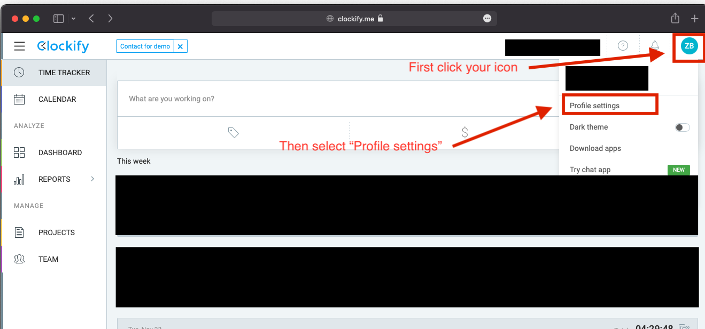
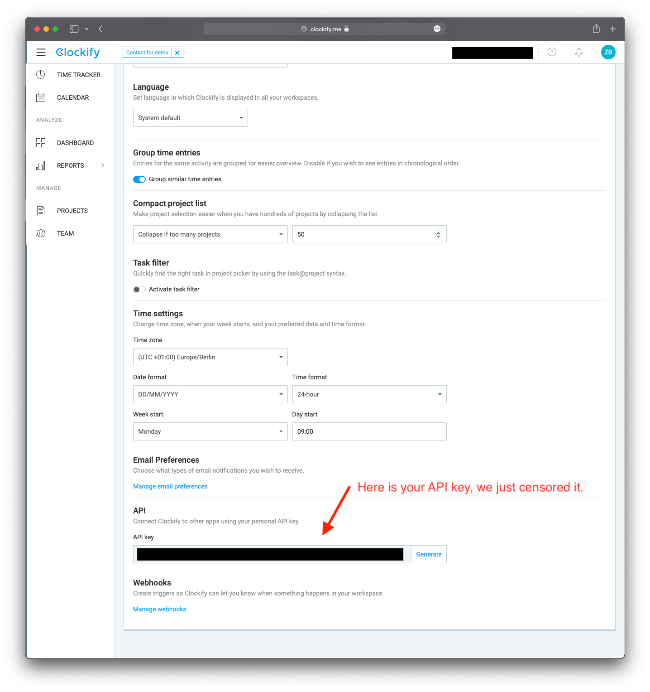

# Overview

This document is giving you and overview over DataLbry's Clockify Connector version 0.0.1.

## What is Clockify

> Clockify is the most popular free time tracker and timesheet app for teams of all sizes. Unlike all the other time
> trackers, Clockify is available for an unlimited numbers of users for free. Clockify is an online app that works in a
> browser, but you can also install it on your computer or phone for convenience.
>
> -- <cite>https://clockify.me/about-us</cite>

## Obtaining Credentials

To be able to use Clockify's API, you need to obtain the **API key** and the **base endpoint**. To do so you need to
have Clockify already set up. You can do so by simply heading over to [https://clockify.me](https://clockify.me) and
creating an account if you don't already have one. Then you need to log in with your email and password.

:::note

If you have a self-hosted Clockify instance, then your URL will look different.

:::

### API key

After you have logged in you can obtain your **API key**. You can do so by first clicking on your icon in the top
right of your window, then selecting `Profile Settings` and lastly scrolling to the end of the page. On the bottom
you will see now your API key. These two steps are visualized by the next two images.

:::info

If you set up a connector with a particular API key and in future regenerate the API. Then you will need to update
the API key in the respective connectors too.

:::

### Base endpoint

If you don't have a self-hosted clockify instance, then your endpoint is `https:/api.clockify.me/api/v1`.
If you have a self-hosted clockify instance, then your endpoint is `https://yourcustomdomain.com/api`.
For more information please check out: [https://clockify.me/developers-api](https://clockify.me/developers-api)

## Targeted Documents

Currently, the following documents are targeted by the connector:

- The clients
- The groups
- The projects
- The tags
- The tasks
- The entered time entries
- The users
- The workspaces

:::info

The connector targets all information which you can see in the Clockify's frontend.

:::
