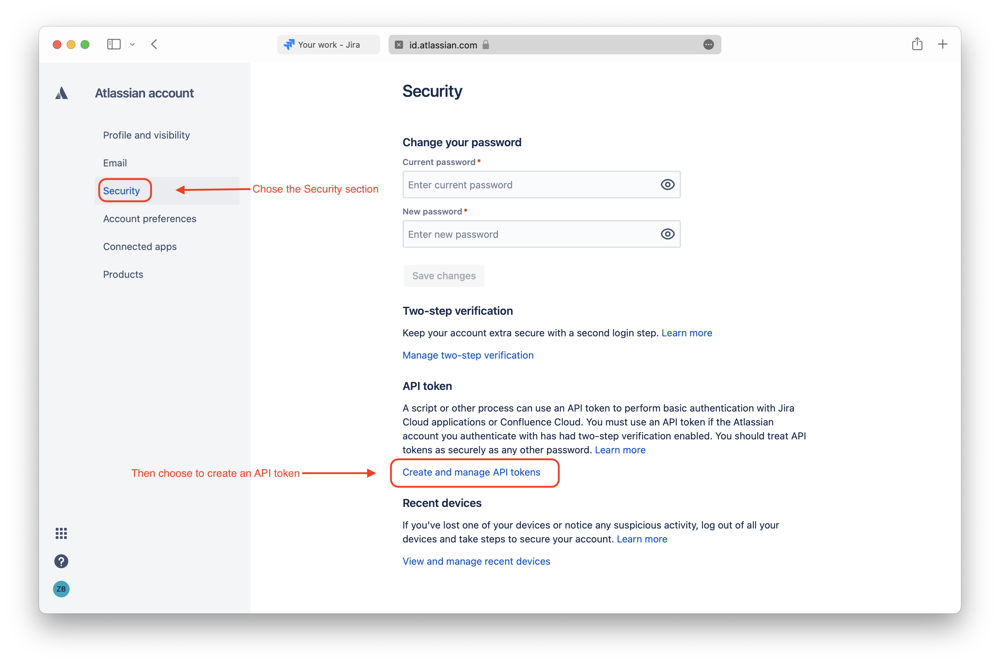
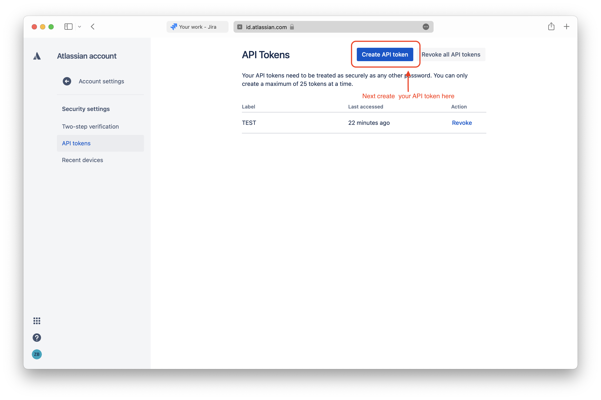
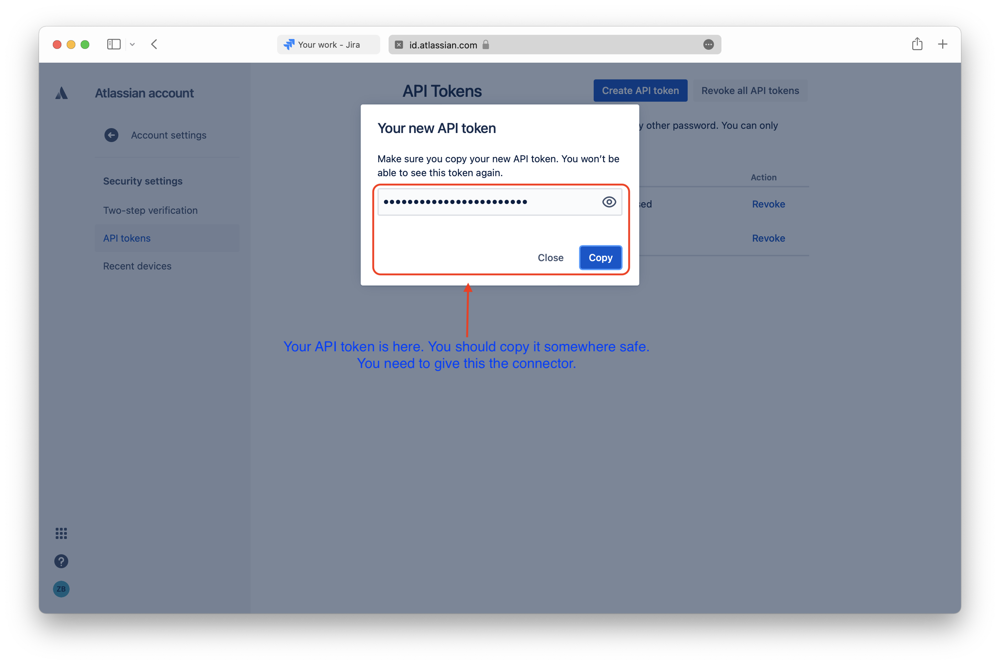

# Overview

This document is giving you an overview of the DataLbry's Confluence Cloud Connector for version `0.0.1`.

## What is Confluence Cloud?

[Confluece Cloud](https://www.atlassian.com/de/software/confluence) is software which enables teams to centrally create, collaborate and organize their work.

> Create, collaborate, and organize all your work in one place. Confluence is a team workspace where knowledge and collaboration meet. Dynamic pages give your team a place to create, capture, and collaborate on any project or idea. Spaces help your team structure, organize, and share work, so every team member has visibility into institutional knowledge and access to the information they need to do their best work. Learn more about features in Confluence.
> Confluence is for teams of any size and type, from those with mission-critical, high-stakes projects that need
rigor behind their practices, to those that are looking for a space to build team culture and engage with one another in a more open and authentic way.
> Equipped with Confluence, your team can make quick decisions, gain alignment, and accomplish more together.
> -- <cite>Source: [Confluence](https://www.atlassian.com/software/confluence/guides/get-started/confluence-overview#about-confluence) </cite>

## Obtaining Credentials

The following credentials are required to use the Confluence Cloud Connector:

- Confluence Cloud URL
- Confluence Cloud username
- Confluence Cloud personal access token (secret)

Typically, the **URL** of a Confluence Cloud instance looks like this: `https://<your-organization>.atlassian.net`.

The **username** is simply your email address which you use to log into your Confluence Cloud instance.

Lastly you will need a  **personal access token**. To obtain such a token you can simply follow [Atlassians offical
documentation on how to do so](https://support.atlassian.com/atlassian-account/docs/manage-api-tokens-for-your-atlassian-account/)

We have captured the next steps in form of images for you too.

## Targeted Documents

The following documents are provided by the connector with detailed information:

- Spaces
- Content Documents:
    - Pages
    - Attachments
    - Comments

Additionally, the following records are stored:

- Content Ancestor
- Content Body
- Content View
- History
- Icon
- Label
- User
- Version

