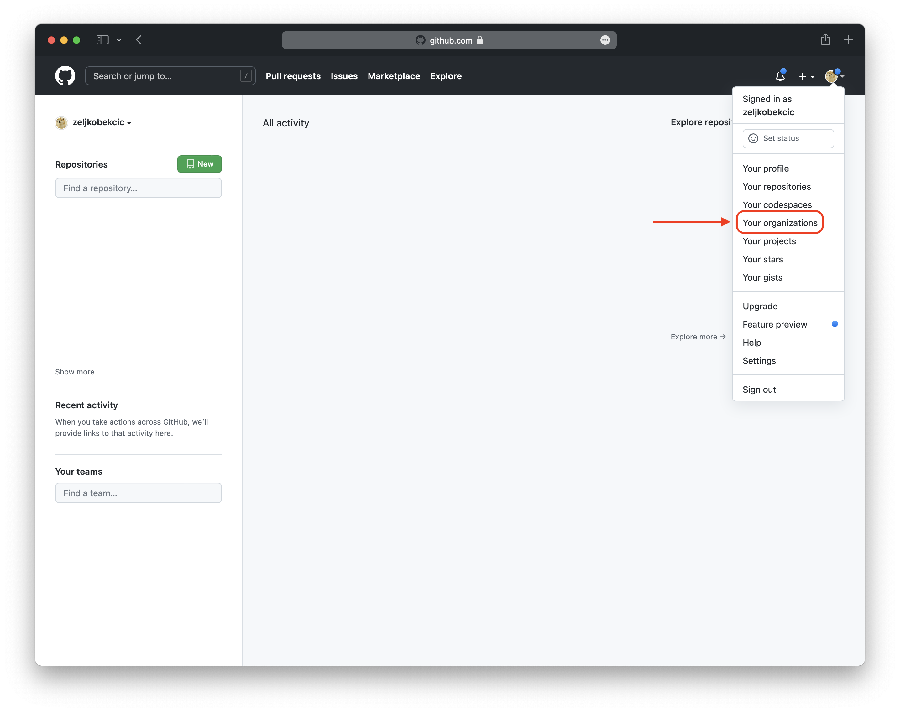
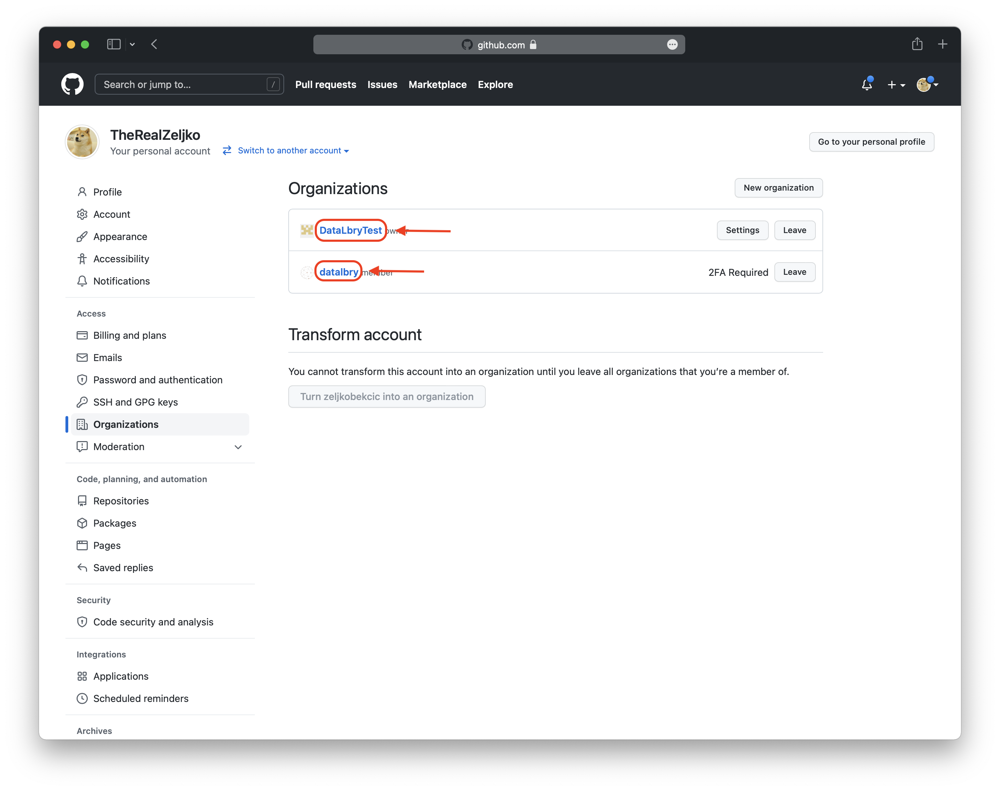

# Overview

This document is giving you an overview of the DataLbry's GitHub Connector for version `0.1.0-alpha.1643708449`.

## What is GitHub?

> GitHub, Inc. is a provider of Internet hosting for software development and version control using Git. It offers the
> distributed version control and source code management (SCM) functionality of Git, plus its own features. It provides
> access control and several collaboration features such as bug tracking, feature requests, task management, continuous
> integration and wikis for every project.
>
> -- <cite> https://en.wikipedia.org/wiki/GitHub </cite>

## Obtaining Credentials

To be able to use this connector you need the to provide your **personal access token**. To do so, you first
need to log into your GitHub account at [https://github.com](https://github.com/). Then you have to
follow [GitHub's official documentation on how to obtain your personal access token](https://docs.github.com/en/authentication/keeping-your-account-and-data-secure/creating-a-personal-access-token)
.

:::caution

If you set your personal access key valid for only 7 days, then the connector will be able to load the data from GitHub
for only 7 days too.

:::

Lastly you have to give your personal access token all read/view permissions. Such that the connector can actually read
the data.

## Targeted Documents

Currently, the following documents are targeted by the connector:

- Logged in User
- Organizations
- Repositories of logged-in user and organizations
- Issues of repositories
- Releases of repositories

## Additional Options

### Organization Filter

Filtering for organization can be achieved in two ways. Either by using an **Allow
Filter** or an **Deny Filter**. To use any filter you hae to provide the **organization name**.

The *Allow Filter* allows the connector to process only the organizations you specified.
The *Deny Filter* denies the connector to process organizations you specified.

:::info

If an organization is in both filters, then the connector will be denied processing it.

:::

:::info

The filter affect also documents that are part of a project. For example: If you deny the connector processing an
organization, then it's repositories and issues will not be processed either. This is because a repository or issue
are part of an organization.

:::

To use these filters you have to provide the *organization name*. In the following pictures you are shown how to
obtain the *organization name* for the filter. First you need to log into your GitHub account. Then you click on the
top right on your icon. A menu will appear, there you select "Your organizations". This is shown in the next image.

Now you see an overview of your organizations. The marked boxes show the *organization name*. In this example the
*organization names* are `DataLbryTeset` and `datalbry`.

