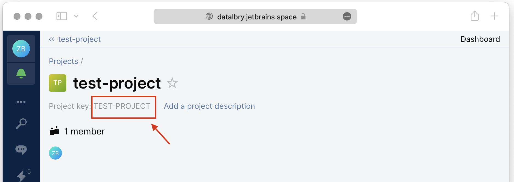

# Overview

This document is giving you an overview of the DataLbry's JetBrains Space Connector for version `0.1.0-alpha.1643645113`.

## What is JetBrains Space?

[JetBrains Space](https://www.jetbrains.com/space/) is an all-in-one solution for:

- building and delivering software
- collaboration and communication
- team management
- project management

## Obtaining Credentials

To be able to use this connector you need the following:

1. Client ID
2. Client Secret
3. JetBrains Space URL

A JetBrains Space URL looks like the following: `https://<your-organization>.jetbrains.space`. Where you set the value for `<your-organization>` upon creating the JetBrains Space instance. For example here at DataLbry we would use `https://datalbry.jetbrains.space`

To obtain the Client ID and Client Secret you need to have an existing JetBrains Space instance. Then you can head over to [JetBrains' official documentation on how to obtain the credentials](https://www.jetbrains.com/help/space/client-credentials.html#basics). Thereafter you will have an Application setup in your JetBrains Space instance. Additionally you need to give this application all Read/View permissions. 

## Targeted Documents

The following documents are provided by the connector with detailed information:

- Absences
- Blogs
- Profiles
- Projects
- Issues
- Checklists
- Repositories
- CodeReviews

## Additional Options

### Project Filter

Filtering for projects can be achieved in two ways. Either by using an **Allow
Filter** or an **Deny Filter**. To use any filter you hae to provide **Project
Keys**. 

The *Allow Filter* allows the connector to process only the Projects you specified.
The *Deny Filter* denies the connector to process Projects you specified.

:::info

If a project is in both filters, then the connector will be denied processing it.

:::

:::info

The filter affect also documents that are part of a project. For example: If
you deny the connector processing a project, then it's issues will not be
processed either. This is because an issue if part of a project.

:::

To use these filters you have to provide the *Project key*. In the following picture you see a test project in our
JetBrains Space instance. The *Project key* - surrounded by the red box - in this example is `TEST-PROJECT`.

