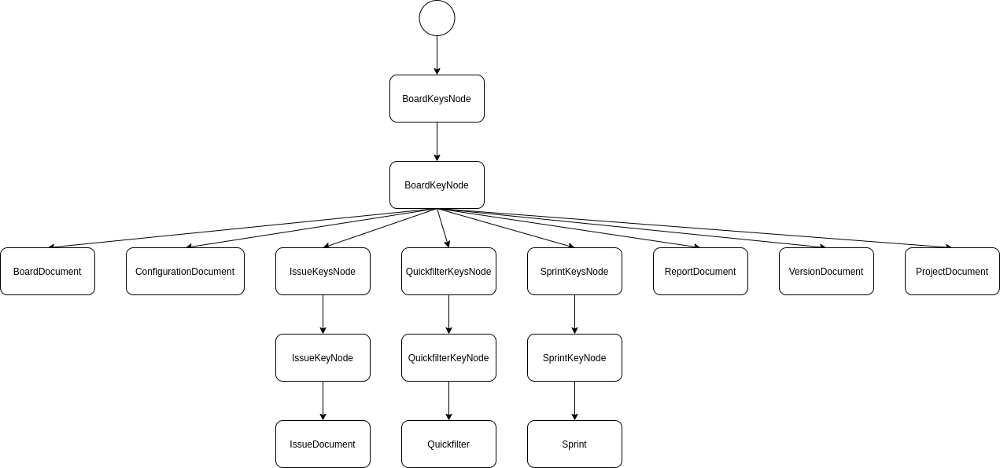

# Overview

This document is giving you an overview of the DataLbry's Jira Cloud Connector.

## What is Jira Cloud?

[Jira Cloud](https://www.atlassian.com/software/jira) is software to manage software development better by planning and tracking.

## Targeted Documents

Currently, the following documents targeted by the connector are:

- Boards
- Configurations
- Issues
- Projects
- Quickfilters
- Reports
- Versions

Additionally, the following records are stored:

- Admins
- Attachment
- AvatarUrls
- ColumnConfig
- Column
- Comment
- Comments
- Estimation
- Feature
- Field
- Fields
- Filter
- Group
- IssueFields
- IssueLinks
- IssueLinkType
- IssueStatusDetails
- IssueType
- Location
- Priority
- Progress
- Ranking
- StatusCategory
- Status
- Subquery
- Timetracking
- Transitions
- User
- Votes
- Watches

### Derivation Tree

The following image visualizes the derivation tree for the connector.

The `ContentIdNode` has a recursive relation because of the pages. A page can contain attachments and comments. In the end a Page, Attachment and Comment are all just a `ContentDocument`.

## Supported Version

## What it pulls

## Security

There are no security features implemented like an ACL (Access Control List) or similar.

