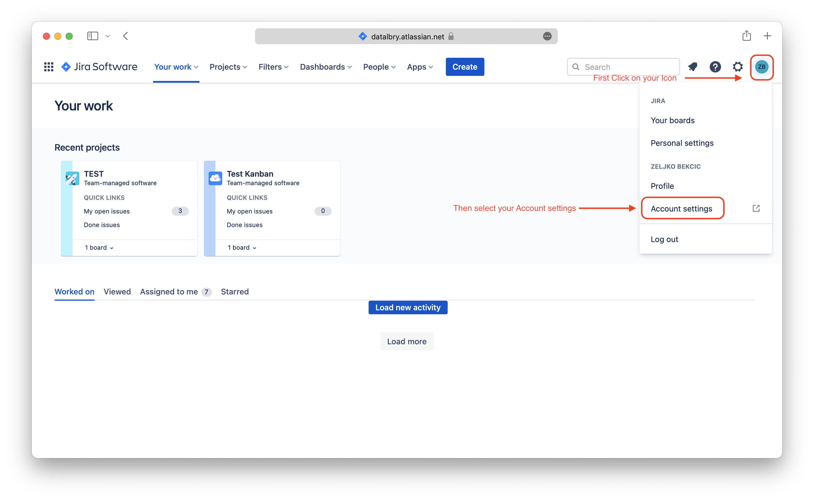
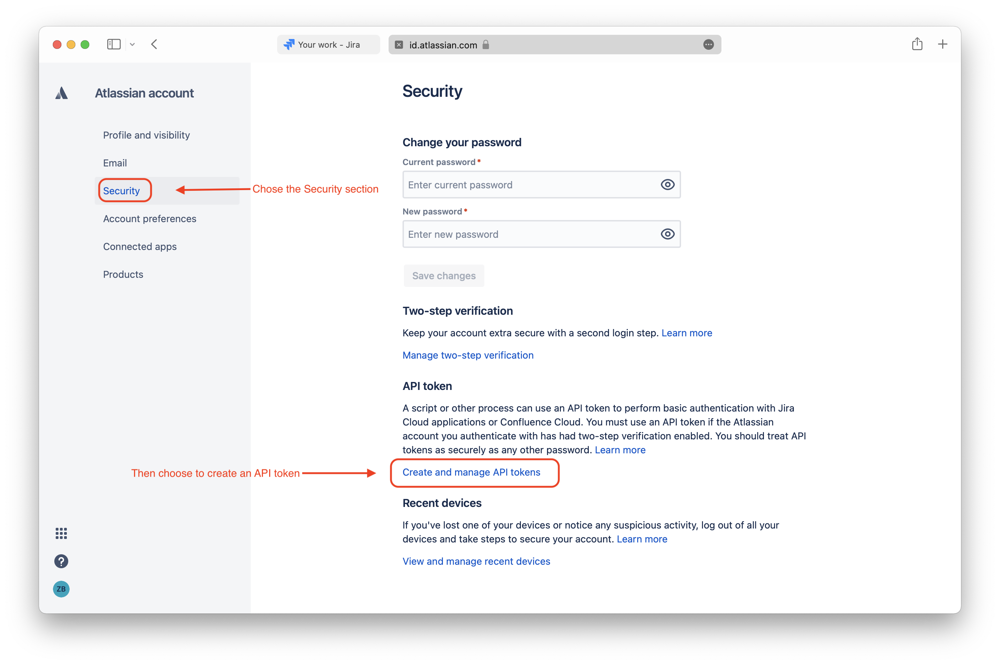
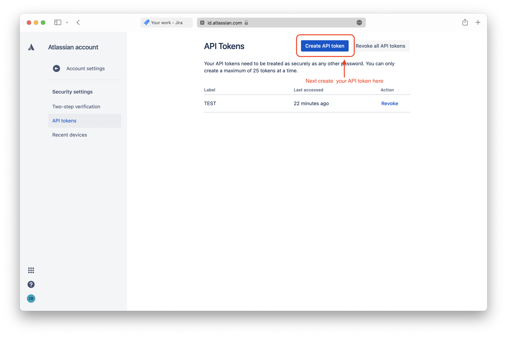
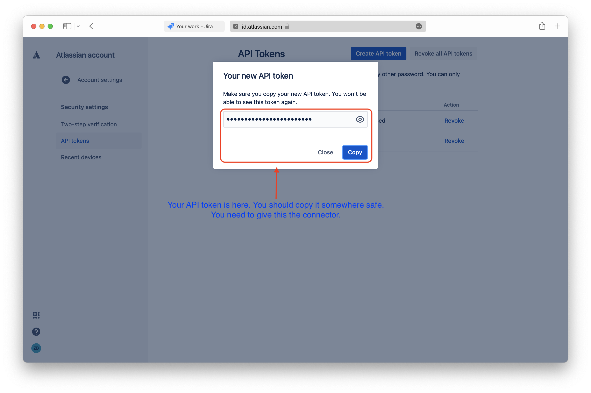
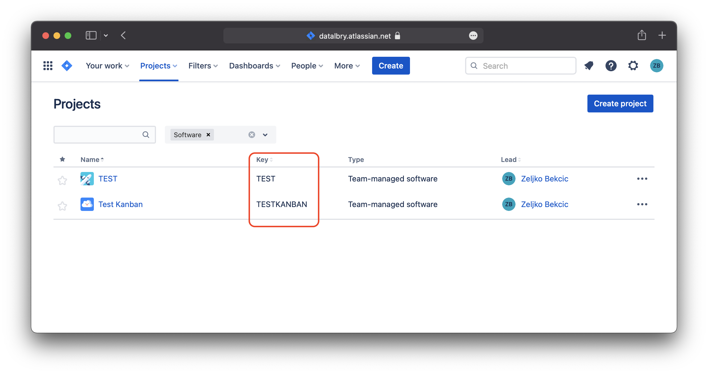

# Overview

This document is giving you an overview of the DataLbry's Jira Cloud Connector for version `0.1.0-alpha.1643626976`.

## What is Jira Cloud ?

[Jira Cloud](https://www.atlassian.com/software/jira) is software to manage software development better by planning and tracking.

## Obtaining Credentials

The following credentials are required to use the Jira Cloud Connector:

- Jira Cloud URL
- Jira Cloud username
- Jira Cloud personal access token (secret)

Typically, the **URL** of a Jira Cloud instance looks like this: `https://<your-organization>.atlassian.net`.

The **username** is simply your email address which you use to log into your Jira Cloud instance.

Lastly you will need a  **personal access token**. To obtain such a token you can simply follow [Atlassians offical
documentation on how to do so](https://support.atlassian.com/atlassian-account/docs/manage-api-tokens-for-your-atlassian-account/)

We have captured the next steps in form of images for you too.

## Targeted Documents

The following documents are provided by the connector with detailed information:

- Board
- Board configurations
- Issues in a board
- Projects
- Quickfilters of a board
- Reports of a board
- Versions/Releases

## Additional Options

### Project Filter

There is an **Allow Filter** and **Deny Filter** for projects. The *Allow Filter* lets only pass project boards
which you configured and accordingly the *Deny Filter* does not let the project boards pass which you configured.

To use these filters you have to provide the *Project key*. In the following picture you see some projects in our
Jira Cloud instance. The *Project keys* - surrounded by the red box - in this example are `TEST` and `TESTKANBAN`.

If you provide this *Project key* in the *Allow Filter* then this project board will be in the final document set.
If it is set in the *Deny Filter* on the other hand it will be filtered out and therefore not be present in the
final document set. If the *Project key* is in both filters it will always be filtered out. This goes for all documents
derived by the project board too.
