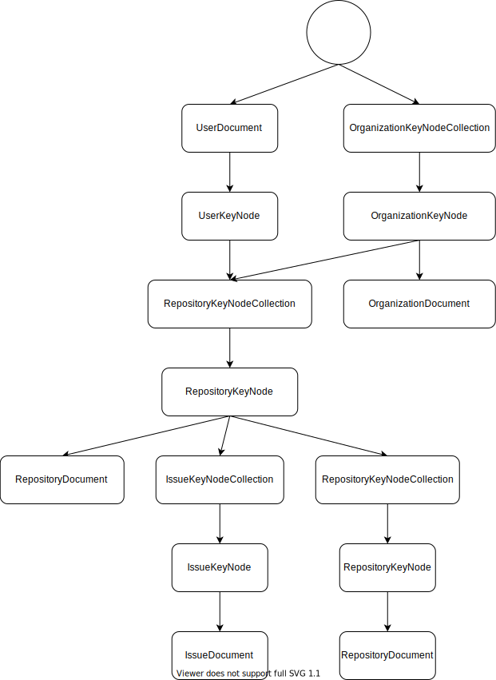

# Quickstart

In this quickstart you will set up DataLbry's GitHub connector.

## 1. Dependencies

You will need the following dependencies to run the code and develop:

- [Docker](https://www.docker.com/)
- [Gradle](https://gradle.org/)
- Java 8
- [Kotlin](https://kotlinlang.org/)

## 2. Obtaining the Code

You can obtain the code simply with Git. The GitHub connector is on GitHub. So you can go to your desired directory and
execute the following command to download the code with git.

```sh
$ git clone git@github.com:datalbry/github-connector.git
```

## 3. Obtaining the GitHub credentials

To be able to use the API for GitHub you need obtain your personal access token. Now that you have obtained the
credentials you need to add them to your gradle properties. We don't want to store them in the project properties
because it can happen that they leak into the git repository making them effectively public. Instead, insert them into
your gradle properties at `~/.gradle/gradle.properties`

You will need to add the following two properties:

```
datalbry.github.uri=https://api.github.com/
datalbry.github.secret=<secret>
```

The tests only work on DataLbry's GitHub instance.

## 4. Downloading the dependencies

If you are using an IDE like IntelliJ IDEA then you probably don't need this part but if you are using the gradle cli
then you can download the dependencies with gradle `./gradlew build`

## 5. Derivation Tree

The following shows the derivation tree of the connector. You can see there all transitions of the processors.


